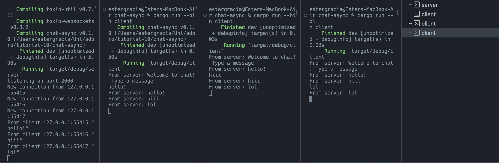

1. The screenshot: 
    
    The server is the leftmost. Run it using:
    ```
    cargo run --bin server
    ```
    And run the client using:
    ```
    cargo run --bin client
    ```
    When I typed something in the client, the server received it and broadcasted it to all clients. The clients received the message and printed it out. The server also printed out the message it received and from which client. 